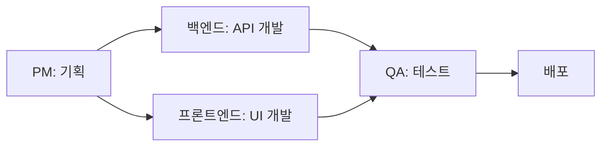

# 🤖 AI 에이전트 팀

Public Lab 프로젝트를 위한 AI 에이전트 역할 정의

## 📋 사용 방법

각 에이전트 역할 파일을 참고하여 Claude Code에게 명확한 역할을 부여하세요.

### 기본 사용법

```
"[역할명]처럼 [작업내용]을 해줘"
```

**예시:**
- "백엔드 개발자처럼 사용자 로그인 API를 만들어줘"
- "프론트엔드 개발자처럼 로그인 페이지를 디자인해줘"
- "보안 전문가처럼 생년월일 암호화 코드를 작성해줘"
- "QA처럼 로그인 기능을 테스트해줘"
- "PM처럼 다음 스프린트 계획을 세워줘"

## 🎯 에이전트 역할

### 1. [백엔드 개발자](./backend-developer.md)
서버, API, 데이터베이스 개발 담당

### 2. [프론트엔드 개발자](./frontend-developer.md)
UI/UX, 화면 개발 담당

### 3. [QA/테스터](./qa-tester.md)
품질 보증, 테스트, 버그 발견 담당

### 4. [보안 전문가](./security-expert.md)
개인정보 보호, 보안 취약점 분석, 데이터 암호화 담당

### 5. [PM/기획자](./product-manager.md)
제품 기획, 우선순위 결정, 로드맵 관리 담당

## 🚀 협업 워크플로우



### 전형적인 기능 개발 흐름

1. **PM**: 기능 정의 및 요구사항 작성
2. **백엔드**: API 및 데이터베이스 개발
3. **프론트엔드**: 사용자 인터페이스 개발
4. **QA**: 통합 테스트 및 버그 수정
5. **반복**: 피드백 반영 후 개선

## 💡 팁

- 한 번에 한 역할에만 집중하세요
- 역할 전환 시 명확하게 알려주세요
- 각 역할의 전문성을 활용하세요
- 팀원들과 어떤 역할을 맡을지 나눠보세요

## 📞 에이전트 호출 예시

### 새 기능 개발
```
1. "PM처럼 '사용자 프로필' 기능 요구사항 정리해줘"
2. "백엔드 개발자처럼 프로필 API 만들어줘"
3. "프론트엔드 개발자처럼 프로필 페이지 만들어줘"
4. "QA처럼 프로필 기능 테스트해줘"
```

### 버그 수정
```
1. "QA처럼 로그인 버그를 재현해줘"
2. "백엔드 개발자처럼 버그 원인을 찾아줘"
3. "백엔드 개발자처럼 버그를 수정해줘"
4. "QA처럼 수정사항을 테스트해줘"
```

### 기획 회의
```
1. "PM처럼 이번 주 완료할 기능 목록 정리해줘"
2. "PM처럼 우선순위를 매겨줘"
3. "PM처럼 각 기능의 예상 시간을 추정해줘"
```

---

**Made with ❤️ by Public Lab Team**
